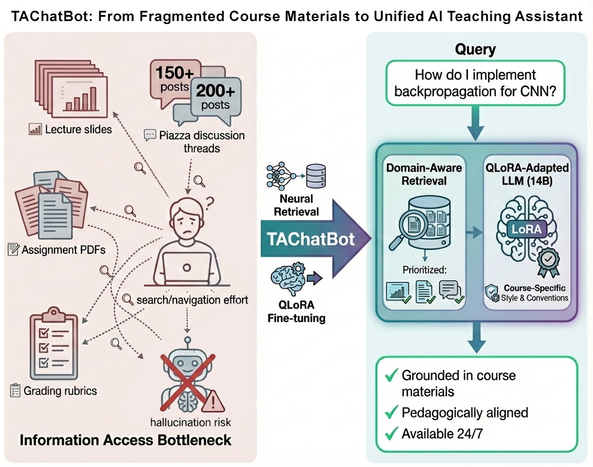
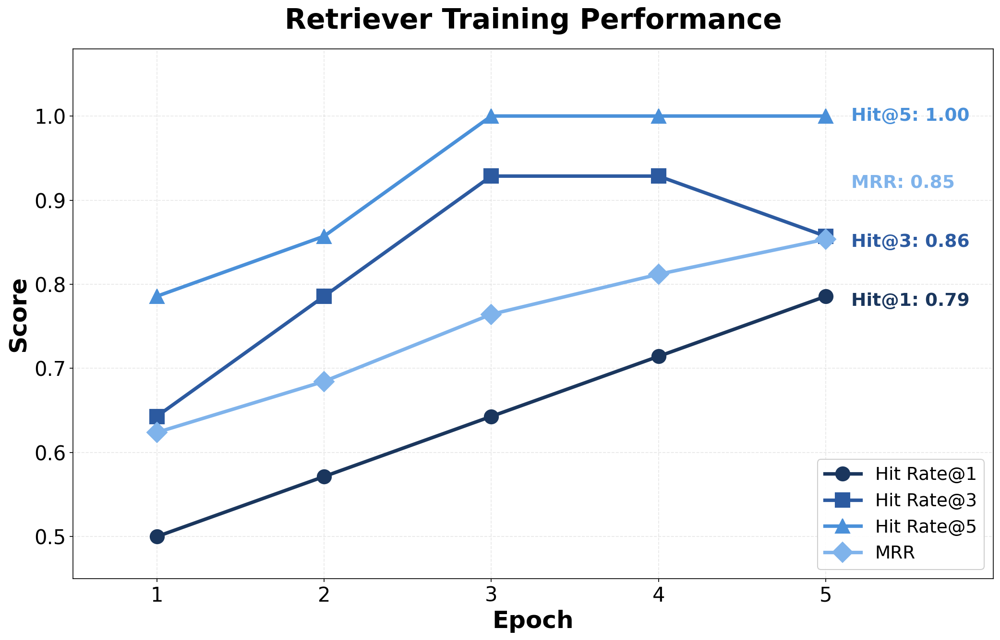

# TAChatBot - RAG with LoRA Fine-tuning

A teaching assistant chatbot combining Retrieval-Augmented Generation (RAG) with LoRA fine-tuning for accurate and context-aware responses to course-related questions.



## Overview

This project implements a two-stage RAG system designed for educational Q&A:

### Stage 1: Intelligent Retrieval (Sentence-BERT)
- **Fine-tuned Sentence-BERT** (all-MiniLM-L6-v2) for semantic document retrieval
- **Query-aware filtering**: Assignment queries exclude lecture slides, lecture queries include all sources
- **Tag-based filtering**: Questions tagged with specific topics only retrieve relevant documents
- **Multiple Negatives Ranking Loss** with BM25-based hard negative mining

### Stage 2: Context-Aware Generation (Qwen-2.5 + LoRA)
- **LoRA Fine-tuned Qwen-2.5-14B-Instruct** for answer generation
- **4-bit quantization (QLoRA)** for memory efficiency
- Generates responses grounded in retrieved context

## Key Features

✅ **Intelligent Document Filtering**
- Assignment-related queries: Only searches assignments + Piazza (excludes lecture slides)
- Lecture/concept queries: Searches all document types
- Tag-based filtering: Queries inherit topic tags for precise retrieval

✅ **Hallucination Prevention**
- System prompts explicitly prevent fabricated URLs and references
- Answers grounded only in retrieved context

✅ **Flexible Architecture**
- Supports multiple generator models (Qwen, Mistral, Llama)
- Configurable quantization (4-bit, 8-bit, FP16, FP32)
- ChromaDB integration for scalable vector storage

## Project Structure

```
TAChatBot/
├── src/
│   ├── chatbot.py              # Complete RAG pipeline
│   ├── retriever.py            # Sentence-BERT fine-tuning & retrieval
│   ├── generator.py            # LLM LoRA fine-tuning & generation
│   ├── data_preparation.py     # Data loading & augmentation
│   ├── evaluation.py           # Metrics (Hit@k, MRR, similarity)
│   └── utils.py                # Helper functions
├── scripts/
│   ├── process_raw_qa.py       # Parse Piazza Q&A data
│   ├── prepare_rag_data.py     # Prepare retrieval corpus
│   ├── train_retriever.py      # Train retriever script
│   └── ...                     # Other data processing scripts
├── notebooks/
│   └── colab_training.ipynb    # Complete training notebook (Colab-ready)
├── data/
│   ├── raw/                    # Place your raw course materials here
│   ├── processed/              # Processed JSON data
│   └── splits/                 # Train/val/test splits + documents.json
├── models/                     # Trained model checkpoints
├── figures/                    # Result visualizations
├── chatbot_ui.html             # Demo web interface
├── requirements.txt
└── LICENSE
```

## Quick Start

### Installation

```bash
git clone https://github.com/YOUR_USERNAME/TAChatBot.git
cd TAChatBot
pip install -r requirements.txt
```

### Using Pre-trained Models (Inference Only)

```python
from src.chatbot import RAGPipeline

# Load trained models
rag = RAGPipeline(
    retriever_path="models/retriever-finetuned",
    generator_path="models/generator-finetuned",
    use_chromadb=True
)

# Ask a question
response = rag.ask("How do I implement backpropagation?")
print(response['answer'])
```

### Training Your Own Models

See the [Training Guide](#training-on-google-colab) below.

## Data Format

### Preparing Your Data

1. **Lecture Slides**: Place PDF files in `data/raw/slides/`
2. **Assignments**: Place PDF/markdown files in `data/raw/assignment/`
3. **Piazza Q&A** (optional): Export and place in `data/raw/raw_qa.txt`

### Sample Data Included

The repository includes sample processed data for demonstration:

**Training Data** (`data/splits/`):
- `train.json`: 109 Q&A pairs with hard negatives
- `val.json`: 12 Q&A pairs
- `test.json`: 13 Q&A pairs

**Retrieval Corpus** (`data/splits/documents.json`):
- 805 documents with metadata (doc_type, tags, assignment_number, etc.)

### Data Formats

**Q&A Pairs** (`data/processed/piazza_qa_pairs.json`):
```json
{
  "question": "Can I use pretrained models for the project?",
  "answer": "Yes, you can use pretrained models...",
  "tags": ["project"],
  "source": "Piazza"
}
```

**Documents** (`data/splits/documents.json`):
```json
{
  "text": "Problem 1: Implement backpropagation...",
  "doc_type": "assignment",
  "assignment_number": "1",
  "section_title": "Problem 1: Backpropagation",
  "tags": ["assignment1"],
  "source": "Assignment 1 - Problem 1"
}
```

## Training on Google Colab

**Recommended**: Use Google Colab with GPU for training.

### Step 1: Setup
1. Upload this project folder to Google Drive
2. Open `notebooks/colab_training.ipynb` in Colab
3. Enable GPU: Runtime → Change runtime type → T4/A100 GPU
4. Mount Google Drive and set project path

### Step 2: Train Retriever (~30 minutes)
- Uses Multiple Negatives Ranking Loss with hard negative mining
- Expected metrics: Hit@3 > 0.9, MRR > 0.8

### Step 3: Train Generator (~2-3 hours on A100)
- LoRA fine-tuning with 4-bit quantization
- Only ~0.4% of parameters are trained

### Step 4: Evaluate
- Test retrieval with diverse queries
- Evaluate generation quality with semantic similarity

## How It Works

### Query-Aware Retrieval

**Assignment Queries** (detected by keywords: assignment, homework, due, submit):
```
Query: "What are the requirements for assignment 1?"
↓
1. Detect assignment keywords → exclude lecture slides
2. Detect "assignment 1" → filter to assignment 1 docs only
3. Search filtered set (~20 docs instead of 805)
4. Return relevant assignment sections + Piazza posts
```

**Lecture/Concept Queries**:
```
Query: "How does backpropagation work?"
↓
1. No assignment keywords → search all documents
2. Semantic similarity ranking
3. Return relevant slides + assignments + Piazza
```

### Tag-Based Filtering

Questions inherit topic tags from their source (e.g., `assignment1`, `project`). During retrieval, only documents with matching tags are considered.

## Model Configuration

### Retriever (Sentence-BERT)
| Parameter | Value |
|-----------|-------|
| Base Model | `all-MiniLM-L6-v2` (22M params) |
| Loss | Multiple Negatives Ranking Loss |
| Hard Negatives | 3 per example (BM25-mined) |
| Training | 5 epochs, batch size 16 |

### Generator (Qwen-2.5 + LoRA)
| Parameter | Value |
|-----------|-------|
| Base Model | `Qwen/Qwen2.5-14B-Instruct` |
| LoRA Rank | 8 |
| LoRA Alpha | 16 |
| Quantization | 4-bit (QLoRA) |
| Max Context | 2048 tokens |

## Evaluation Metrics

### Retrieval
- **Hit Rate@k**: Whether correct document appears in top-k results
- **Mean Reciprocal Rank (MRR)**: Reciprocal rank of first correct document

### Generation
- **Semantic Similarity**: Cosine similarity between generated and reference answers
- **Accuracy**: Percentage of answers above similarity threshold (0.7)

## Results

### Retriever Training


After 5 epochs:
- Hit Rate@1: 78.6%
- Hit Rate@3: 85.7%
- Hit Rate@5: 100%
- MRR: 0.854

## Requirements

- Python 3.8+
- CUDA-capable GPU (16GB+ VRAM for training, 8GB for inference)
- For Colab: T4 (free) or A100 (Pro) recommended

### Key Dependencies
- `transformers>=4.36.0`
- `sentence-transformers>=2.2.0`
- `peft>=0.7.0`
- `bitsandbytes>=0.41.0`
- `chromadb>=0.4.0`

## Adapting to Your Course

1. **Collect Materials**: Gather lecture slides (PDF), assignments, and Q&A data
2. **Process Data**: Run scripts in `scripts/` to extract and format data
3. **Create Splits**: Generate train/val/test splits with `scripts/create_splits_from_new_data.py`
4. **Train Models**: Use the Colab notebook or local training scripts
5. **Deploy**: Use `chatbot_ui.html` for a simple web interface

## Citation

If you use this project, please cite:

```bibtex
@misc{tachatbot2024,
  title={TAChatBot: A RAG-based Teaching Assistant with LoRA Fine-tuning},
  author={Contributors},
  year={2024},
  url={https://github.com/YOUR_USERNAME/TAChatBot}
}
```

## License

This project is licensed under the MIT License - see the [LICENSE](LICENSE) file for details.

## Acknowledgments

- [Sentence-Transformers](https://www.sbert.net/) for the retriever architecture
- [Hugging Face](https://huggingface.co/) for transformers and PEFT libraries
- [ChromaDB](https://www.trychroma.com/) for vector storage
